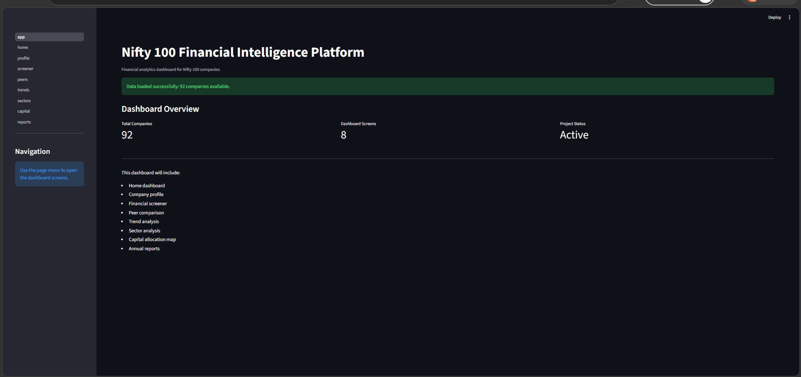
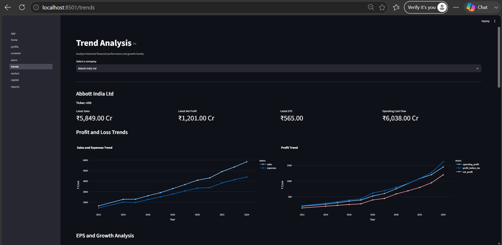
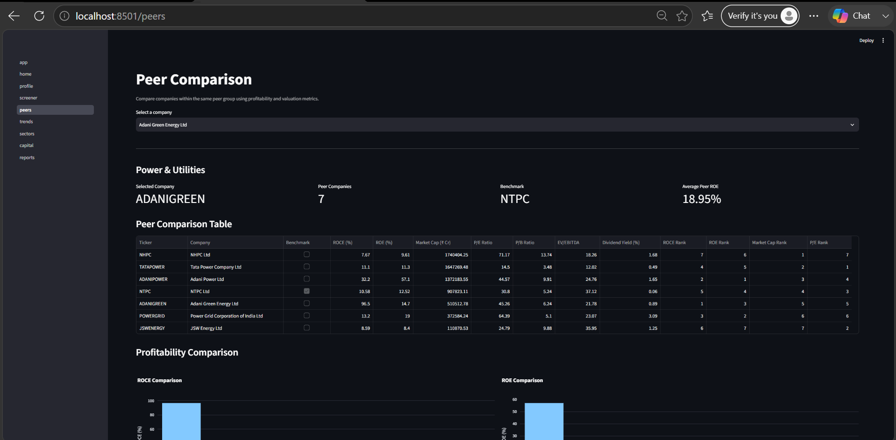
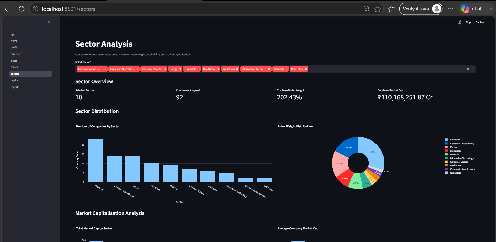
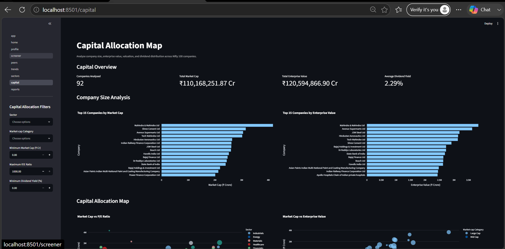

# N100 Financial Intelligence Platform

A financial analytics and intelligence platform for analysing NIFTY 100 companies using financial statements, valuation metrics, peer comparisons, clustering, portfolio statistics, NLP insights, dashboards, PDF reports, and a FastAPI backend.

## Project Overview

The N100 Financial Intelligence Platform is designed to provide structured financial intelligence for 92 companies using historical company data, financial ratios, valuation metrics, sector information, peer groups, clustering, and annual-report documents.

The platform includes:

- Financial statement analysis
- Financial ratio analysis
- Valuation analysis
- Company screening
- Sector analysis
- Peer comparison
- Portfolio clustering
- Portfolio-level statistics
- Annual report document access
- Company tearsheet PDF generation
- Streamlit dashboard
- REST API using FastAPI
- Automated API testing
## Key Features

- Analyze financial statements and key financial ratios across 92 companies.
- Screen companies using financial and valuation metrics.
- Compare companies with sector and peer-group benchmarks.
- Perform relative valuation using P/E, P/B, EV/EBITDA, and dividend yield.
- Cluster companies based on financial characteristics and portfolio statistics.
- Generate NLP-based company pros and cons from financial information.
- Generate automated company tearsheets, sector reports, and portfolio reports in PDF format.
- Explore financial insights through an interactive Streamlit dashboard.
- Access company, sector, peer, valuation, portfolio, and document data through FastAPI endpoints.
- Validate backend functionality using automated Pytest API and unit tests.
## Dashboard Preview

### Platform Overview



### Financial Trend Analysis



### Peer Comparison



### Sector Analysis



### Capital Allocation Analysis


## Technology Stack

- Python
- Pandas
- NumPy
- Scikit-learn
- SQLite
- FastAPI
- Uvicorn
- Streamlit
- Matplotlib
- ReportLab
- Pytest
- HTTPX

## Requirements

- Python 3.13 or later
- pip
### Install Dependencies

Clone the repository and navigate to the project directory, then install the required Python packages:

```bash
pip install -r requirements.txt
```

### Build the Database

The SQLite database can be rebuilt from the source Excel files using:

```bash
python build_database.py
```

This creates the database tables for companies, financial statements, ratios, sectors, peer groups, valuation data, documents, and pros/cons.
## Running the Application

### Start the FastAPI Backend

```bash
python -m uvicorn src.api.main:app --port 8000
```

API documentation will be available at `http://127.0.0.1:8000/docs`.

### Start the Streamlit Dashboard

Open another terminal and run:

```bash
python -m streamlit run src/dashboard/app.py
```

The dashboard will be available at `http://localhost:8501`.

### Run Tests

```bash
python -m pytest -q
```
## Project Structure

- `data/` - Source Excel datasets and SQLite financial database
- `output/` - Generated analytics outputs and portfolio statistics
- `reports/` - Company tearsheets, sector reports, and portfolio reports
- `scripts/` - Data processing and utility scripts
- `src/analytics/` - Financial analytics, valuation, clustering, and KPI logic
- `src/api/` - FastAPI backend and API routers
- `src/dashboard/` - Streamlit dashboard, pages, and utilities
- `src/nlp/` - Annual-report parsing and pros/cons generation
- `src/reports/` - PDF report generation
- `tests/` - Automated unit and API tests
- `API_ENDPOINTS.md` - API endpoint documentation
- `build_database.py` - Builds the SQLite database from source datasets
- `requirements.txt` - Python dependencies